# SeismicData
# 📊 **Seismic Data Visualization Project**

**A project for analyzing, visualizing, and mapping seismic data using MiniSEED files and IRIS API data.**

---

## 🚀 **Project Overview**

This project processes and visualizes seismic data from MiniSEED files and IRIS API. It includes:
- Importing and storing seismic data into a **SQLite database**.
- Creating **Helicorder-style charts** from seismic data.
- Interactive **Folium-based maps** with station markers.
- Data filtering by **network** and **MiniSEED availability**.
- Search and filter capabilities with interactive map controls.

---

## 📦 **Features**

- ✅ **Data Import:** Supports importing `.mseed` files into a database.
- ✅ **Interactive Maps:** View station locations with dynamic clustering.
- ✅ **Helicorder Charts:** Visualize seismic activity with time-series charts.
- ✅ **Search & Filter:** Filter stations by network and data availability.
- ✅ **Dynamic Popups:** Metadata and charts displayed on station markers.

---

## 🛠️ **Setup Instructions**
### **Folder setup**
- ├── main.ipynb            # Google Colab Notebook
- ├── README.md             # Project Documentation
- ├── SEP/                 # Seismic data files (.mseed) for SEP, generic import can pull any .mseed format
- └── Data/database.db           # SQLite Database (ignored by Git)
- └── Test_Data/*.db&.mseed      # SQLite testing DB and single test mseed
### **1. Start Here**

Run the following setup block in your **Google Colab Notebook** Or Locally,
you will possibly need to run this section twice, or you can simply 'run all' trice for the full program:
The git clone setup will download the files into the current directory
If you need to setup colab, then you need to set 'Initial_Setup' to True
and will download the repo and create the SeismicData folder,
Then it will move the files into the current directory for the rest of the workbook.
It will warn you to restart the session after setup is done.
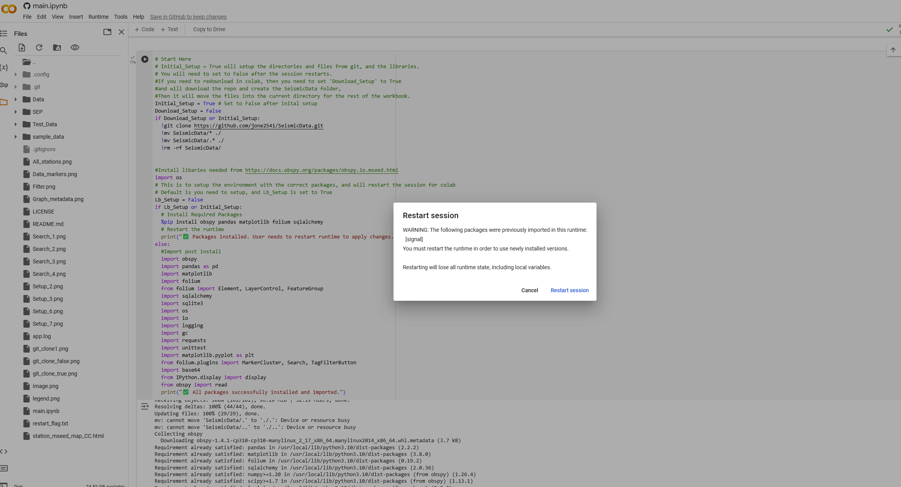

Set to false if you don't want to download the files locally, default it does
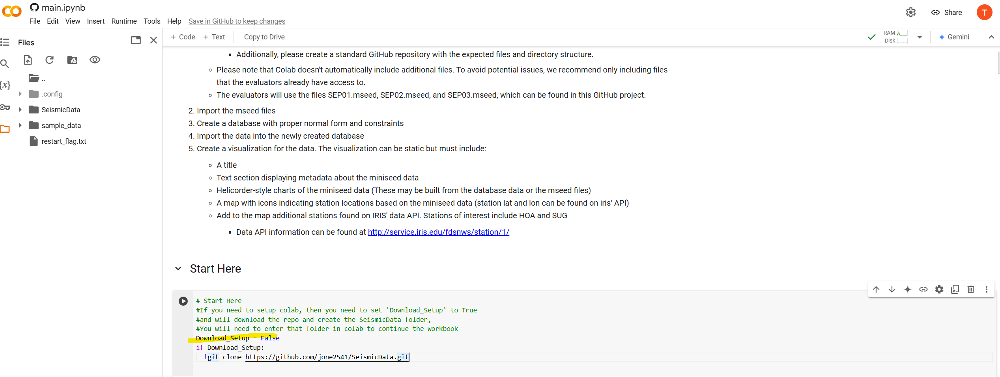

```python
# Start Here
# Initial_Setup = True will setup the directories and files from git, and the libraries.
# You will need to set to False after the session restarts.
#If you need to redownload in colab, then you need to set 'Download_Setup' to True
#and will download the repo and create the SeismicData folder,
#Then it will move the files into the current directory for the rest of the workbook.
Initial_Setup = True # Set to False after inital setup
Download_Setup = False
if Download_Setup or Initial_Setup:
  !git clone https://github.com/jone2541/SeismicData.git
  !mv SeismicData/* ./
  !mv SeismicData/.* ./
  !rm -rf SeismicData/


#Install libaries needed from https://docs.obspy.org/packages/obspy.io.mseed.html
import os
# This is to setup the environment with the correct packages, and will restart the session for colab
# Default is you need to setup, and Lb_Setup is set to True
Lb_Setup = False
if Lb_Setup or Initial_Setup:
  # Install Required Packages
  %pip install obspy pandas matplotlib folium sqlalchemy
  # Restart the runtime
  print("✅ Packages installed. User needs to restart runtime to apply changes...")
else:
  #Import post install
  import obspy
  import pandas as pd
  import matplotlib
  import folium
  from folium import Element, LayerControl, FeatureGroup
  import sqlalchemy
  import sqlite3
  import os
  import io
  import logging
  import gc
  import requests
  import unittest
  import matplotlib.pyplot as plt
  from folium.plugins import MarkerCluster, Search, TagFilterButton
  import base64
  from IPython.display import display
  from obspy import read
  print("✅ All packages successfully installed and imported.")
```
Set the Initial_Setup Variable to False
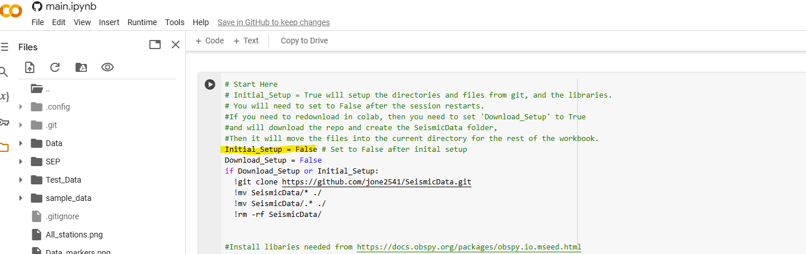
Then click 'run all'
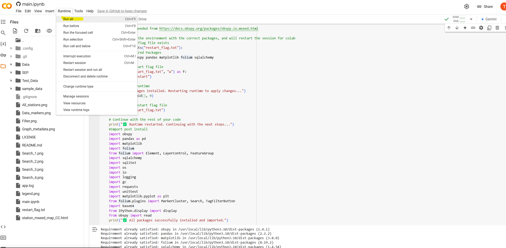
You should see it return this:
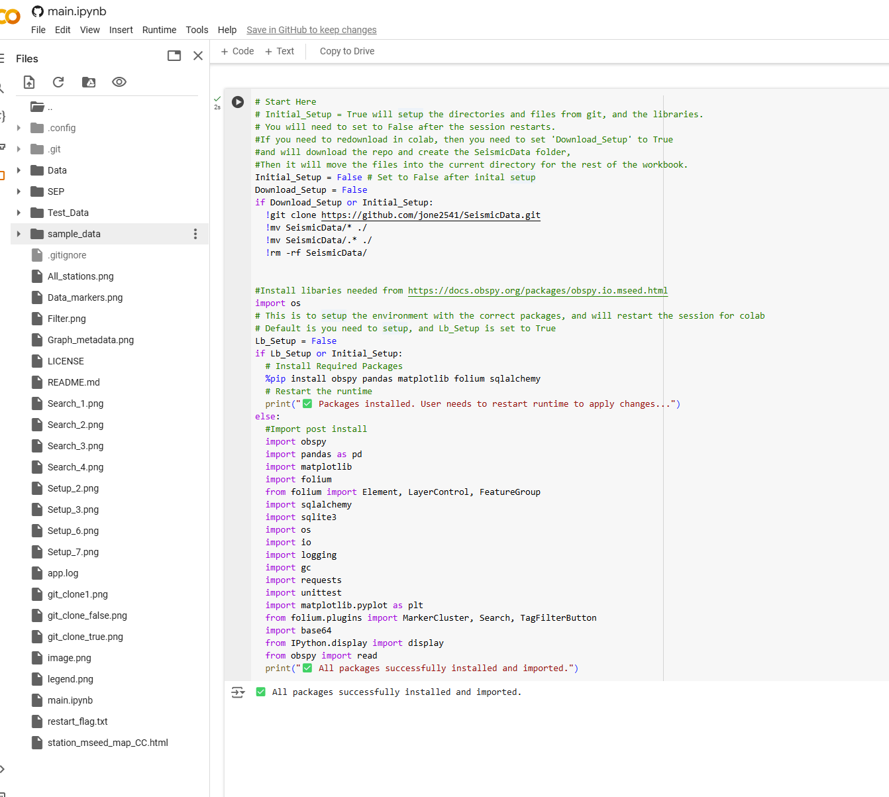
Then at the bottom of the playbook, you should see it complete with the baseline configuration
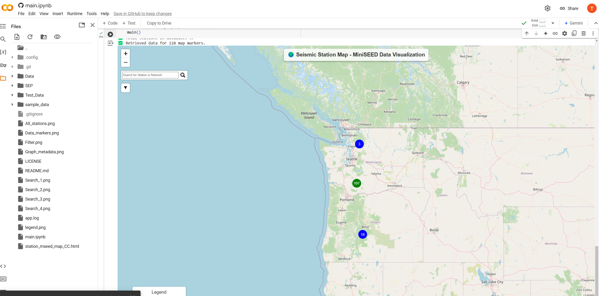
### **2. Usage**
Define the SQLite DB location, default = 'Data' in main():
```python
def main():
    #Initialize Database
    db_file_path = 'Data'
    ensure_directory_exists(db_file_path)
    conn = get_connection(db_file_path)
    cursor = conn.cursor()
    cursor.close()
    conn.close()
    #Creates a SQLite DB in the given file path, Default 'Data/'
    conn = get_connection(db_file_path)
    cursor = conn.cursor()
    #Creates the tables
    create_tables(cursor)
    #...
```
Define the mseed folders to import in main():
```python
def main():
    #...
    #imports the mseed files in the given path, default 'SEP/'
    mseed_file_path = 'SEP/'
    ensure_directory_exists(mseed_file_path)
    import_streams(conn,cursor,mseed_file_path)
    conn.commit()
    #Queries the IRIS API for the location data, and updates the station table
    update_stations(conn,cursor)
    conn.commit()
```
Define a network filter if needed in main():    
```python
def main():
    #...
    #Imports stations using the IRIS API, the second arguement is used to filter
    # based off of the given network string,if you don't give a second arguement it will
    # import all the stations.
    #import_stations_api(conn,cursor, "CC")
    #import_stations_api(conn,cursor)
    network_filter = "CC"
```
### **3 Unit testing the notebook**
Unit testing will require you to the create a Test_Data folder, and a single mseed file within it.
I advise you to comment out main() when doing unit testing
```python
if __name__ == '__main__':
    unittest.main(argv=[''], exit=False)
    #main()
```
### **4. Run the notebook**
Run the setup, configure in main(), comment out testing if not needed, and then activate:
```python
if __name__ == '__main__':
    #unittest.main(argv=[''], exit=False)
    main()
```
### **5. Using the visualizations**
Using the legend, you can click into clusters that have data:
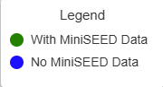
Here's an example of the map without any filter for networks:
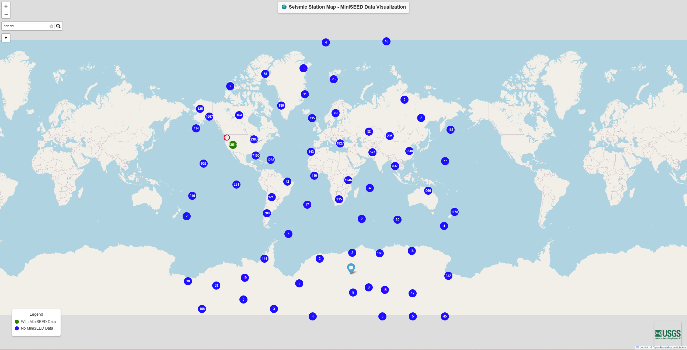
As you click into the clusters you will drill down into markers that have data:
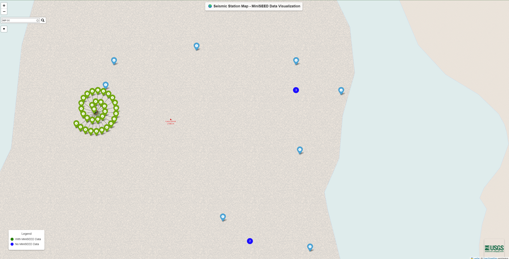
Clicking one with provide the user with a helicorder graph, and mseed metadata:
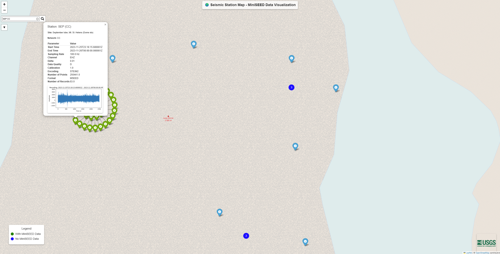
To reduce noise on the map, you can filter markers with or without data:
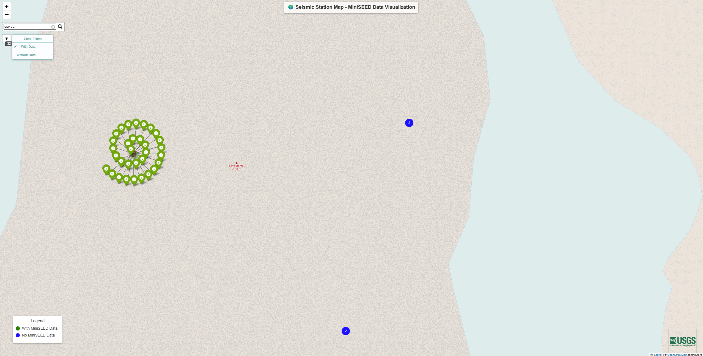
To find specific stations you can search by station name or network, 
click the item in the search box, and then a red circle will appear around it
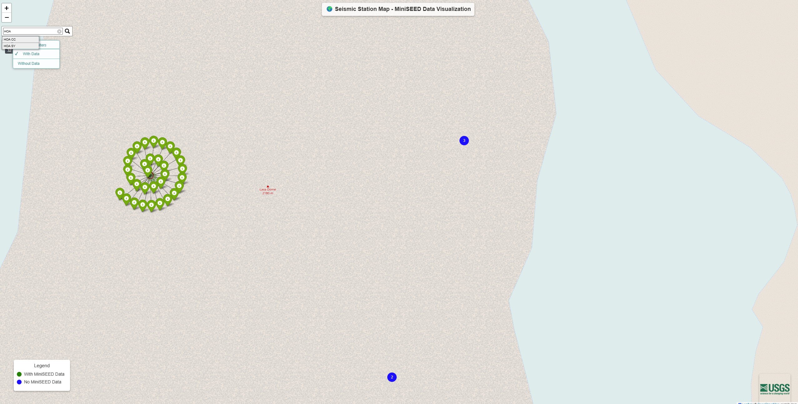
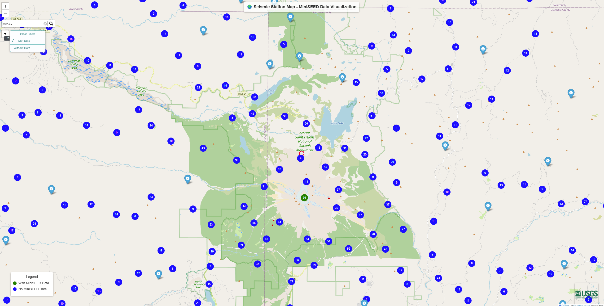
Searching for HOA Station
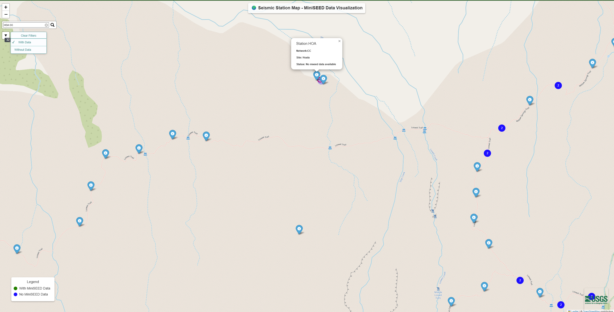
Searching for SUG Station
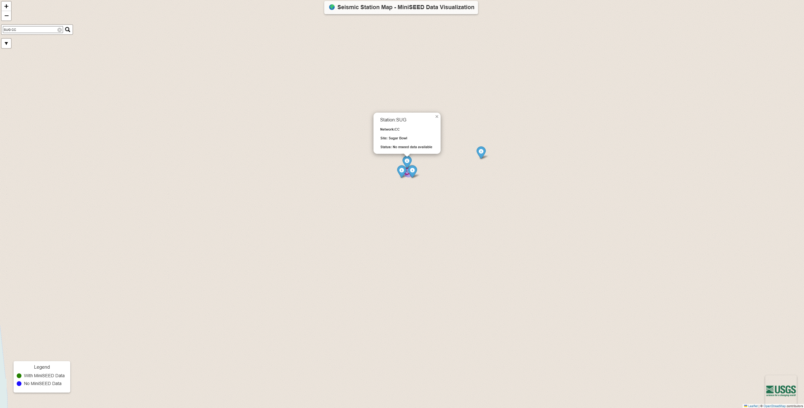
### **6. Future Additions**
- 1: Add parallel processing for the imports, api calls, and generation of the map
- 2: Add generalization and static objects for the javascript, images, and marks used in the html

## 📧 Contact
For inquiries, please reach out via:
- 📧 **Email:** [timothy.g.jones2@gmail.com](mailto:timothy.g.jones2@gmail.com)  
- 🔗 **LinkedIn:** [linkedin.com/in/timothy-jones-735417265](https://linkedin.com/in/timothy-jones-735417265)
